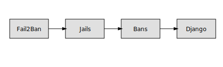

# AGENT INSTRUCTIONS

Этот файл создан скриптом `generate_agents.py`.

## Repo Guidelines
- Всегда выполняйте `pytest -q` и добавляйте вывод в раздел Testing описания PR.
- Если `nano` недоступен, используйте `sed` или `cat >` для редактирования файлов.
- Документацию пишите на русском языке, если не указано иное.
- Создавайте развёрнутые сообщения коммитов.

## UML



## Документация
### templates.md

# Шаблоны для мануального тестирования

В каталоге `templates` находятся файлы-шаблоны, которые можно использовать при проведении ручных тестов. Каждый файл содержит общие пункты, помогающие структурировать сценарии проверки.

Для редактирования шаблонов предназначен скрипт `template_editor.py`. Запустите его без параметров, чтобы увидеть список доступных шаблонов:

```bash
python3 template_editor.py
```

Чтобы отредактировать конкретный файл, передайте его имя в качестве аргумента:

```bash
python3 template_editor.py base_template.txt
```

Редактор выведет текущее содержимое и предложит ввести новый текст. Завершите ввод строкой `EOF` на отдельной строке. После этого изменения будут сохранены в соответствующем файле.


### metaphors.md

# Метафоры и моделирование

Этот раздел посвящён поиску ярких и концептуально целостных аналогий, которые помогают формировать новые идеи. Эвристика — это метод, помогающий искать ответы, поэтому важно учитывать разные факторы во время планирования и анализа.

## Планирование строительного фрактала с приращением жемчужины

Представьте проект в виде фрактальной конструкции, где каждый этап развивается подобно наращиванию слоёв жемчужины вокруг крошечного зерна. Малые детали отражают общий замысел, а каждое приращение усиливает яркость и поддерживает концептуальную целостность всей структуры.

## Световые ритмы и концептуальные соединения

Ещё одна модель сравнивает идеи с лучами света, образующими сложный рисунок. Чем ярче сияет луч, тем яснее замысел, а переплетение световых ритмов создаёт единую структуру. Наблюдая за этими ритмами, легче замечать несогласованные участки и дополнять их новыми решениями.

## Древесные структуры

Проект можно представить как растущее дерево. Ветви тянутся к свету, образуя общий силуэт, а корни питают каждую часть. Поддержка ствола позволяет побегам укрепляться и превращаться в надёжные элементы системы. Эта метафора помогает увидеть взаимосвязи между мелкими деталями и общей целью.

## Кто использует фрактальные аналогии

Приём сравнения кода с фрактальными структурами встречается у различных авторов. Например, Уорд Каннингем отмечал, что расширение функционала может напоминать разрастание фрактала, где небольшие изменения порождают более крупные узоры. Похожими образами пользовались и исследователи паттернов проектирования, вдохновляясь работами Бенуа Мандельброта. Идея фрактальности встречается в обсуждениях архитектуры программ, где внимание уделяется самоподобию и масштабируемости решений.


### manual_tests.md

# Руководство по ручному тестированию

Ниже приведены подробные чек-листы для проверки каждого раздела сайта.

## Главная страница (`index.html`)
- [ ] Анимация автомобиля отображается и вращается.
- [ ] Кнопка показа UML-диаграммы открывает окно с картинкой `uml-diagram.svg`.
- [ ] Меню навигации содержит ссылки на все разделы.

## Страница API (`api.html`)
- [ ] Кнопки загрузки логов выполняют запросы и выводят результат.
- [ ] Ошибки сети отображаются пользователю.
- [ ] UML-диаграмма появляется по нажатию пункта меню `UML`.

## Страница Fail2Ban (`fail2ban.html`)
- [ ] Кнопка **Jail Status** выводит список активных тюрем.
- [ ] Кнопка **Banned IPs** показывает блокированные адреса.
- [ ] Отображается диаграмма `fail2ban-uml.svg` при выборе UML.

## Документация (`docs.html`)
- [ ] Список конечных точек API соответствует актуальной реализации.
- [ ] Ссылки внутри страницы работают корректно.
- [ ] Раздел с описанием ручных тестов указывает на данный файл.

## Прочие страницы
- [ ] На страницах `modules.html`, `plan.html` и `crossref.html` корректно работает всплывающее окно с UML-диаграммой.
- [ ] Все ссылки в меню ведут на существующие разделы.
- [ ] Страница `login.html` переключает поля между паролем и SSH ключом.
- [ ] MFA код принимается вместе с выбранным методом входа.


### review.md

# Краткий обзор репозитория

Репозиторий содержит статический сайт на основе Material Design Lite и небольшой набор Python-скриптов. Основные файлы:

- `backend_tools.py` — демонстрация работы с SSH и HTTP.
- `template_editor.py` — редактор текстовых шаблонов для ручных тестов.
- HTML‑страницы для различных разделов сайта, каждая из которых может показать UML‑диаграмму.

Тесты покрывают функции редактирования шаблонов и взаимодействия с сервером. Структура модулей описана в `module_decomposition.md`, а план разработки — в `development_plan.md`.
Сайт может разворачиваться как набор статических файлов или внутри Django-проекта, где HTML размещается в каталоге `static`.

Обновлённая документация включает файл `manual_tests.md` с подробными чек-листами. Диаграммы SVG отображают связь между клиентом, сервером и вспомогательными инструментами.

